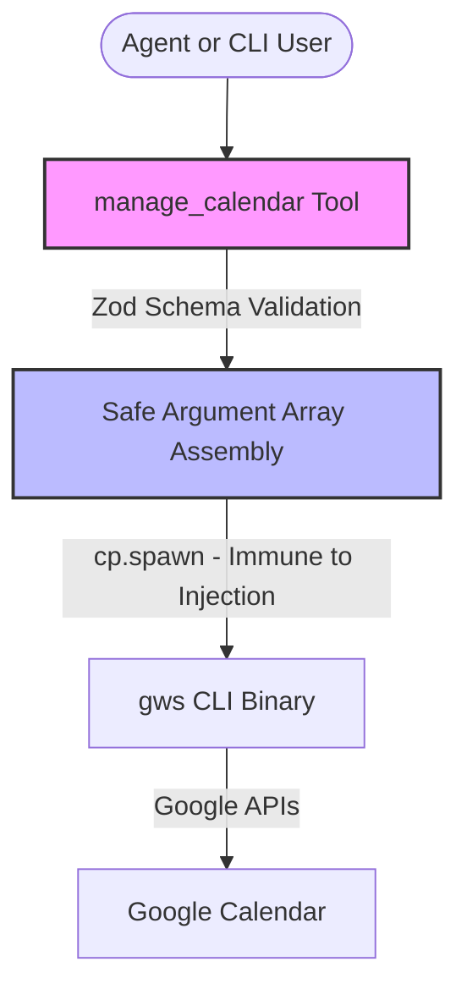

# 📅 Reminder: Finish GWS Calendar Adapter Details

> [!IMPORTANT]
> **Scheduled Reminder:** Sunday morning, May 31, 2026.
> **Status:** 🚀 Skeletons, schemas, and main agent registration are **completed**!
> **Tomorrow's Focus:** Finalize any specific GWS CLI configurations, verify OAuth/token bindings, and test the flow.

---

## 🎯 Goal Accomplished So Far
Instead of the agent struggling to synthesize complex CLI arguments for the `gws` command directly (which often causes invalid args), we have wrapped all GWS calendar operations inside a single, intuitive LangChain tool: **`manage_calendar`**.

We have successfully:
1. Created calendar types in [calendar.ts](file:///e:/Web/miniclaw/src/agent/types/calendar.ts).
2. Implemented the [manage_calendar](file:///e:/Web/miniclaw/src/agent/tools/calendar.ts) tool which maps actions (`create`, `update`, `delete`, `list`) directly into secure, sanitised `gws` subprocess calls.
3. Registered the tool in `createMainAgent` inside [agents.ts](file:///e:/Web/miniclaw/src/agent/agents.ts).

---

## 🏗️ Architecture

### Supported API Actions
* **`list`**: Fetches agenda using `gws calendar +agenda` (supports filtering with `--today`, `--tomorrow`, `--week`, `--days`, `--calendar`).
* **`create`**: Inserts a new event using `gws calendar +insert` (supports `--summary`, `--start`, `--end`, `--location`, `--description`, `--meet`, `--attendee`).
* **`update`**: Patches an event using `gws calendar events patch` with a serialized JSON update body.
* **`delete`**: Removes an event using `gws calendar events delete`.

---

## 📋 Implementation Checklist for Tomorrow Morning

- [ ] **Verify Authentication & Config Paths**
  - [ ] Run a test command to check if GWS has valid credentials (e.g. `gws calendar list`).
  - [ ] Ensure that `gws` is in the execution path or alias.
- [ ] **Test Tool Actions**
  - [ ] Test the `list` action via the agent or a small test script.
  - [ ] Test the `create` action to confirm Google Meet URLs and attendee notifications work correctly.
  - [ ] Test `update` and `delete` to verify Google API event ID synchronization.
- [ ] **Add Unit Tests**
  - [ ] Create `src/tests/calendar.test.ts` to mock `cp.spawn` and assert correct argument generation for the GWS CLI.

---

> [!TIP]
> The custom calendar tool uses a safe `cp.spawn("gws", args)` argument array wrapper. This completely eliminates shell syntax/injection bugs and guarantees that the agent can't fail due to wrong command-line formatting!
