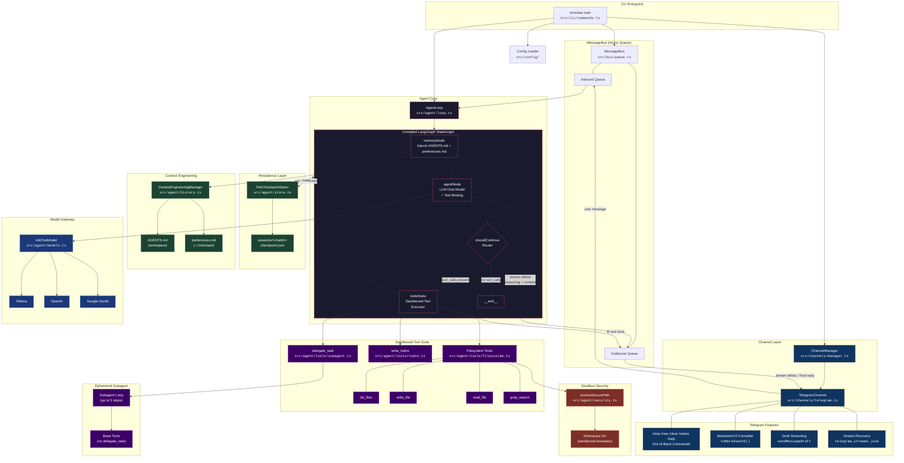

# Miniclaw Features and Implementation Notes

This document lists the features intentionally implemented in the `miniclaw` assistant runtime in a structured tree format, explaining to other developers how each capability is architected and what functionalities remain planned as [TBD] tasks.

---

## 🗺️ System Architecture Overview

---

## 🚀 Intentional Features & Architecture Tree

### 🤖 Agent Loop & Orchestration
* **Compiled LangGraph Architecture** (`src/agent/loop.ts` & `src/agent/nodes.ts` & `src/agent/state.ts`)
  + Uses a compiled `StateGraph` consisting of distinct nodes:
    - **`memoryNode`**: Loads global memory preferences (`preferences.md`) and workspace instructions (`AGENTS.md`) and attaches them to `SystemMessage`.
    - **`agentNode`**: Bound with dynamic sandboxed tools and streams token results in real time.
    - **`toolsNode`**: Runs filesystems and todos tools sequentially, emitting out-of-band status cues to the bus.
    - **`shouldContinue`**: Conditional edge router mapping LLM tool invocation triggers.
  + Employs declarative LangGraph states utilizing `messages`, `workspaceDir`, and `chatId` state annotations.
* **Universal Model Gateway Routing** (`src/agent/models.ts`)
  + Standardizes model configurations to LangChain's universal `initChatModel` router.
  + Dynamically normalizes model names (e.g. converting custom prefix styles like `google_genai:` to standard provider formats).
  + Custom URL, Base Gateway, and Routing rules for:
    - **Ollama**: Connects to local/cloud services via custom `baseUrl` matching `OLLAMA_API_URL`.
    - **OpenAI**: Configures base URLs matching `OPENAI_API_BASE` for custom gateway and proxy routes.
    - **Google GenAI**: Configures security API keys and turns on advanced settings like `reasoningEffort: "medium"` for Gemini models.
* **Unified Reasoner & Real-time Stream Parser** (`src/agent/loop.ts` & `src/agent/nodes.ts`)
  + Integrates `IncrementalThinkExtractor` to dynamically isolate thinking thoughts enclosed in `<think>...</think>` blocks.
  + Streams reasoning outputs instantly as `_reasoning_delta` chunks.
  + Shuts reasoning blocks using `_reasoning_end` and transitions seamlessly into standard response streaming via `_stream_delta`.
  + Persists the full accumulated response in the history buffer even if the stream is closed prematurely or aborted.
* **Ephemeral Subagent Tool Task Guard** (`src/agent/tools/subagent.ts`)
  + Spawns ephemeral, autonomous subagents for deep research and heavy file manipulation tasks.
  + Restricts recursive subagent spawning by filtering out the `delegate_task` tool from the subagent toolsets.
* **Fail-Safe Fallback Invocation** (`src/agent/nodes.ts`)
  + Automatically catches any errors during stream initialization.
  + Gracefully falls back to a clean, non-streaming `modelWithTools.invoke` execution path to maintain agent responsiveness.

---

### 🔒 Store & Checkpointing
* **Durable File Checkpointer** (`src/agent/store.ts`)
  + Implements a custom `FileCheckpointSaver` extending `MemorySaver` to persist graph states automatically on every `put` and `putWrites` trigger.
  + Serializes and writes thread session states directly to `<appDir>/sessions/<chatId>/checkpoint.json`.
  + Supports transactional archivers and hard wipes for total thread control.

---

### 🔒 Paths & Sandbox Security
* **Strict Sandboxed Paths Resolution** (`src/agent/security.ts`)
  + Implements mathematical boundary checks (`resolveSecurePath`) to ensure resolved absolute targets begin with the workspace absolute path.
  + Rejects directory traversals (`../`), symbolic link escapes, and external target overrides with a custom `PathTraversalError`.
  + Captures errors gracefully at the tool execution level and feeds a diagnostic warning back to the agent prompt to prevent app crashes.
* **Sandboxed Workspace Media Folders** (`src/config/paths.ts` & `src/channels/telegram.ts`)
  + Standardizes downloaded document media directories to reside dynamically at `<workspaceDir>/media`.
  + Places all down-bound attachments and generated document structures inside secure boundaries where sandboxed filesystem tools have direct, safe read/write permissions.

---

### 🛠️ Sandboxed Tool Suite
* **`list_files`** (`src/agent/tools/filesystem.ts`)
  + Lists contents and structures of the active workspace with strict path limits.
* **`write_file`** (`src/agent/tools/filesystem.ts`)
  + Safely writes text files. Automatically builds missing intermediate folders.
* **`read_file`** (`src/agent/tools/filesystem.ts`)
  + Fully optimized for the LangChain DeepAgent specification.
  + Supports **0-indexed pagination** via `offset` (starting line) and `limit` (max lines to retrieve) parameters to keep the prompt context small.
  + Converts file text to Unix `cat -n` formatting, featuring right-aligned line numbers.
  + Implements character splitting for very long lines (exceeding 5,000 characters) into fractional lines (e.g., `1.1`, `1.2`) to protect the token limit.
  + Returns descriptive system alerts (e.g. `System Reminder: The file at "..." exists but is empty`) instead of blank strings.
* **`grep_search`** (`src/agent/tools/filesystem.ts`)
  + Safe JavaScript-native recursive file finder. Does not spawn external processes to completely eliminate shell command injection risks.
  + Skips heavy development and control folders like `node_modules`, `.git`, and `dist`.
* **`write_todos`** (`src/agent/tools/todos.ts`)
  + Tracks and updates active plan checklists inside `.todos.json` in the workspace root.

---

### 💬 Telegram Channel & Messaging Integration
* **Offline-Friendly Update Dispatching** (`src/channels/telegram.ts`)
  + Injects Grambot mock transformers to easily mock/simulate outgoing and incoming events during offline unit testing.
* **Premium Real-Time Stream Drafting** (`src/channels/telegram.ts`)
  + Uses custom draft parameters to stream reasoning thoughts, tool calls, and text outputs sequentially into the **exact same Telegram draft bubble**.
  + Promotes clean layout formatting by writing only the finished, consolidated message once streaming ends.
* **Clean Tool Calling Hints** (`src/agent/nodes.ts` & `src/agent/loop.ts`)
  + Formats tool calling cues (`⚙️ Calling list_files`) directly in the draft bubble.
  + Removes `reply_to` and `metadata.reply_to` headers from the tool cue events, ensuring intermediate execution activity does **not** create redundant user-reply badges.
  + Retains `reply_to` on final response publishing so the actual text replies directly to the original user message.
* **Strict Telegram MarkdownV2 Formatter** (`src/channels/telegram.ts`)
  + Translates standard markdown formats (e.g. `**bold**`, `*italic*`, `` `code` ``) to strict Telegram MarkdownV2 boundaries.
  + Safely escapes MarkdownV2 reserved characters outside of pre-formatted and code contexts.
  + Handles bullet lists, numbering prefixes, and markdown links securely to avoid Telegram `400 Bad Request` API rejections.
* **Fail-Safe Durable Stream Recovery** (`src/channels/telegram.ts`)
  + Saves streaming sessions to `~/.miniclaw/telegram_streams.json` whenever a delta chunk is dispatched.
  + Integrates `recoverStreams` at startup: loads interrupted stream records, cleanly concludes them with a crash notice, and purges the file to avoid orphaned drafts.
  + Automatically flushes and concludes active streams to disk on normal application stopping.
* **Out-of-Band Priority Command Interceptor** (`src/channels/telegram.ts`)
  + Intercepts prefixed commands (`/`) instantly, bypassing the sequential message queue.
  + Registers commands natively with the Telegram Client UI.
  + **Command Actions**:
    - **`/stop`**: Sends an instant `AbortSignal` to cancel current active LLM runs and save partial history.
    - **`/new`**: Cancels active executions and archives the active checkpoint.json file with a timestamp tag.
    - **`/clear`**: Cancels active runs and wipes the active session checkpoint completely.
    - **`/status`**: Prints rich system information (current model, workspace paths, active session message counts parsed from checkpoint, active/idle state) in MarkdownV2.
    - **`/help` / `/start`**: Renders a premium welcome screen and native commands table.

---

## 🛠️ Planned & In-Progress [TBD] Features

* **+ [TBD] calendar: Integration with External Calendars**
  + Connect to Google Calendar and Microsoft Outlook via safe OAuth flow.
  + Provide tools for the agent to list, schedule, reschedule, and delete events.
* **+ [TBD] consolidation: Auto-Consolidation & Daily Summaries**
  + A background service that runs at the end of the day to summarize chat sessions.
  + Writes consolidated insights into a long-term memory file (e.g., `consolidation.md`) to keep history tokens optimal while preserving context.
* **+ [TBD] memory: Dynamic Vector Memory Storage**
  + Move away from flat history lists to a vector-backed semantic memory storage.
  + Enables the agent to query historical facts and user preferences dynamically across sessions.
* **+ [TBD] reminders: Cron-Based Active Reminder Notification Engine**
  + Enable the agent to register active schedules and cron jobs.
  + Dispatches notifications to the Telegram channel to ping the user for upcoming meetings, reminders, or checking off todo lists.
